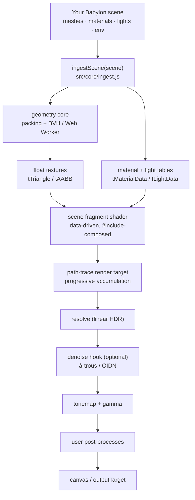

# pt_lib — babylon-pathtracer

A progressive GPU **path tracer** for Babylon.js, packaged as a plugin. You build
a scene the normal Babylon way — `MeshBuilder`, `PBRMaterial`, lights, a glTF
import, `scene.environmentTexture` — hand it to the library, and it path-traces
that scene on the GPU with progressive sample accumulation.

It is **scene-agnostic**: nothing about the model, materials, lights or camera is
hardcoded in a shader. The library reads the live scene, packs it into float
textures (building the BVH off-thread in a Web Worker) and drives a data-driven
fragment shader.

**Milestones M1–M5 are complete, M6 is code-complete (pending a browser run with
a real OIDN module) and M7 (release) is in progress.** This file is the full
library documentation; `README.md` is the short install/usage readme.

---

## What it is

What ships in this package:

- **Progressive path tracing on the GPU.** Each frame adds roughly one sample per
  pixel to an accumulation buffer, so the image refines toward the converged
  result and stops at `maxSamples` (`0` = converge indefinitely).
- **Scene ingestion with no hardcoding.** `scene.meshes` become world-space
  triangles (with tangents), `PBRMaterial` / `StandardMaterial` become a material
  table, Babylon lights become emitters, and `scene.environmentTexture` drives
  image-based lighting.
- **A geometry Web Worker.** World-space packing and the BVH build run off the
  main thread, so a large scene does not freeze the page.
- **Physically-based shading.** Albedo / metallic / roughness / emissive maps,
  normal / bump maps, direct-light sampling (NEE), specular NEE for metals,
  hemispheric + environment lighting, and spot lights as true cones.
- **A denoise-ready pipeline.** `resolve → [denoise hook] → tonemap → gamma` on
  linear HDR, with first-hit AOVs (albedo / normal / depth) kept on the GPU.
- **Two denoisers.** A zero-readback GPU **à-trous** backend, and an **OIDN**
  (Open Image Denoise) driver for a caller-supplied WASM build.
- **Firefly clamping, reproducible sampling and PNG export** (beauty ± AOVs).
- **Extensible post-processing**, plus the Babylon
  `imageProcessingConfiguration` tonemap (exposure, contrast and the Standard /
  ACES / Khronos PBR Neutral curves).
- **Three ways to consume it** — an ESM import, a classic IIFE `script` tag, or
  the individual `src/` files.

## How it works



Per-frame pass order: `scene.render()` → path trace → copy → first-hit AOV pass
(optional) → **resolve** → [**denoise hook**] → tonemap → `options.postProcesses`
→ `options.outputTarget` (default: the canvas).

---

## Status

| | |
|---|---|
| **Done (M1)** | Sources extracted and organized; `PathTracingCommon.js` split into 29 GLSL files |
| **Done (M2)** | Shader composer, automatic uniform binding, `PathTracer` class, glTF adapter; **browser-confirmed**; all GLSL moved into pt_lib's own registry (no writes to `BABYLON.Effect.*`) |
| **Done (M3)** | Babylon scene ingestion: `scene.meshes`, materials, lights, environment; dynamic light/material data; specular NEE; `imageProcessingConfiguration` tonemap; user post-process chain. **Browser-confirmed** |
| **Done (M4)** | Robustness & scalability: geometry-overflow error, capability detection, supported-subset docs/warnings, and the geometry **Web Worker** (option-A shim + equivalence test; on by default) |
| **Done (M5)** | Denoise-ready pipeline: post split (`resolve → [denoise hook] → tonemap → gamma`), first-hit AOVs, firefly clamp, reproducible seed, PNG export |
| **M6 (code)** | Denoise: `src/denoise/oidn.js` drives OIDN's C API through the hook as a one-shot on convergence; a caller-supplied WASM module. **Needs a browser run with a real module** |
| **M7 (in progress)** | Release: ESM + IIFE bundles and hand-written types in `dist/`, npm `exports` manifest, LICENSE + credits. Runnable examples and golden-image tests remain |

---

## Layout

```
pt_lib/
├─ README.md                         # npm readme (install / usage)
├─ PT_README.md                      # full library documentation
├─ package.json                      # exports map, peer dep, build/test scripts
├─ LICENSE  ·  CREDITS.md
├─ vendor/
│  └─ README.md                      # contract for a caller-supplied denoiser module
├─ dist/
│  ├─ pt_lib.core.js                 # GENERATED: registry + shaders + includes + BVH
│  ├─ pt_lib.esm.js                  # GENERATED: ESM bundle (imports @babylonjs/core)
│  ├─ pt_lib.iife.js                 # GENERATED: classic bundle (global BABYLON)
│  └─ pt_lib.d.ts                    # hand-written types
├─ reference/
│  └─ PathTracingCommon.js            # upstream original (split-glsl.mjs input)
├─ tools/
│  ├─ split-glsl.mjs                 # reference/PathTracingCommon.js -> src/core/glsl/*
│  ├─ normalize-scene-shaders.mjs    # scene shaders -> PT_LIB.defineSceneShader(...)
│  ├─ build-core.mjs                 # src/core -> dist/pt_lib.core.js
│  ├─ build-dist.mjs                 # -> dist/pt_lib.esm.js + pt_lib.iife.js
│  ├─ verify-m2.mjs                  # composer + binding + adapter coverage
│  ├─ test-ingest.mjs                # material mapping + geometry capacity
│  ├─ test-lifecycle.mjs             # headless PathTracer lifecycle assertions
│  ├─ test-support.mjs               # capability detection
│  ├─ test-worker.mjs                # worker shim + packing equivalence
│  ├─ test-denoise.mjs               # OIDN driver + one-shot denoise hook
│  └─ test-dist.mjs                  # builds + loads the ESM/IIFE bundles
└─ src/
   ├─ PathTracer.js                  # the plugin class
   ├─ denoise/
   │  ├─ oidn.js                     # OIDN C-API driver + one-shot denoise hook
   │  └─ atrous.js                   # GPU à-trous hook (no readback)
   ├─ core/
   │  ├─ composer.js                 # #include resolution + #define/prelude injection
   │  ├─ uniforms.js                 # automatic uniform/sampler discovery
   │  ├─ ingest.js                   # Babylon scene -> triangles + materials + lights
   │  ├─ geometry-packing.js         # packing + BVH half, shared with the worker
   │  ├─ geometry-worker.js          # Babylon shim + Blob bootstrap + bridge
   │  ├─ glsl/
   │  │  ├─ _registry.js             # PT_LIB.glsl { includes, shaders, scenes }
   │  │  ├─ MANIFEST.json            # order + name + file for every snippet
   │  │  ├─ shaders/                 # 3 shared fragment shaders
   │  │  │  ├─ screenCopyFragmentShader.js
   │  │  │  ├─ screenResolveFragmentShader.js
   │  │  │  └─ screenOutputFragmentShader.js
   │  │  └─ includes/                # 27 reusable GLSL includes (pathtracing_*)
   │  └─ bvh/
   │     ├─ BVH_SAH_Quality_Builder.js   # active builder
   │     └─ BVH_Fast_Builder.js          # faster/lower quality alternative
   └─ scenes/
      ├─ universal/                  # data-driven scene (NO hardcoded content)
      │  ├─ UniversalPathTracing_FragmentShader.js
      │  └─ universal-scene.js
      ├─ gltf/                       # ACTIVE scene (glTF mesh + BVH)
      │  ├─ GLTFModelPathTracing_FragmentShader.js   # registers scene shader "gltf"
      │  ├─ gltf-scene.js                           # adapter for PT_LIB.PathTracer
      │  └─ GLTF_Model_Path_Tracing.js              # legacy host (deprecated)
      ├─ gltf-hdri/                  # glTF + HDRI shader (+ legacy host)
      ├─ gltf-debug/                 # legacy debug host
      ├─ physical-sky/               # sky shader (+ legacy host)
      └─ native/                     # analytic spheres shader (+ legacy host)
```

Each scene folder holds a **scene shader** (registers as
`PT_LIB.defineSceneShader("<folder>", …)`) and optionally a **legacy host**.

---

## Scenes that ship

Two scene adapters are the supported entry points — build the scene, then create
the app:

| Scene | Folder | Adapter | Renders |
|---|---|---|---|
| Universal (data-driven) | `src/scenes/universal/` | `PT_LIB.scenes.universal.create` | Any ingested Babylon scene |
| glTF | `src/scenes/gltf/` | `PT_LIB.scenes.gltf.create` | A glTF/glb model via BVH |

Further shaders/hosts ship for reference and are not wired into a page:
`gltf-hdri/` (HDR panorama), `physical-sky/` (procedural Preetham sky),
`native/` (analytic spheres + quad light) and `gltf-debug/` (a model-loading
harness). The legacy `*_Path_Tracing.js` hosts are deprecated — see *Notes*.

## Two BVH builders

| Builder | File | Trade-off |
|---|---|---|
| SAH Quality (**active**) | `src/core/bvh/BVH_SAH_Quality_Builder.js` | Surface Area Heuristic; higher quality, slower build |
| Fast | `src/core/bvh/BVH_Fast_Builder.js` | Faster build, lower quality |

Both expose the identical API (`BVH_FlatNode`, `BVH_Create_Node`,
`BVH_Build_Iterative`) and work on plain typed arrays, so they are a drop-in
swap — including inside the geometry Web Worker.

---

## Install

```sh
npm install babylon-pathtracer @babylonjs/core
```

```js
import { PT_LIB } from 'babylon-pathtracer';
```

> Not on the npm registry yet — until the first `npm publish`, consume it from a
> checkout with a `file:` dependency, `npm pack`, or the IIFE build below.

`@babylonjs/core` is a peer dependency. The ESM entry also named-exports
`PathTracer`, `scenes`, `denoise`, `glsl`, `ingestScene` and `buildScenePrelude`.

Or as a classic script — load Babylon first, then the IIFE build, which exposes
`window.PT_LIB` (and `BABYLON.PathTracer`):

```html
<script src="https://cdn.babylonjs.com/babylon.max.js"></script>
<script src="https://unpkg.com/babylon-pathtracer/dist/pt_lib.iife.js"></script>
```

The API below is identical either way.

---

## Quick start

The shortest runnable setup: load Babylon, load the one IIFE bundle, then build a
scene the normal Babylon way inside `setup`. The bundle already contains the
GLSL, the BVH, the ingestion modules, both denoisers and the worker sources, so
it is the only library script you need.

```html
<canvas id="renderCanvas"></canvas>

<script src="https://cdn.babylonjs.com/babylon.max.js"></script>
<script src="dist/pt_lib.iife.js"></script>

<script>
  const app = PT_LIB.scenes.universal.create(document.getElementById('renderCanvas'), {
    maxSamples: 256,
    fireflyClamp: 8,          // 0 = off
    setup: (scene, camera) => {
      const ball = BABYLON.MeshBuilder.CreateSphere('ball', { diameter: 2 }, scene);
      ball.material = new BABYLON.PBRMaterial('m', scene);
      ball.material.albedoColor = new BABYLON.Color3(0.85, 0.3, 0.2);
      new BABYLON.PointLight('key', new BABYLON.Vector3(3, 6, -3), scene);
      camera.setTarget(new BABYLON.Vector3(0, 0, 0));
    }
  });

  window.pt = app.pathTracer; // pt.reset(), pt.stop(), pt.dispose() ...
</script>
```

Serve it over HTTP (**not `file://`**) and put
`textures/BlueNoise_RGBA256.png` next to the page — that is the one asset the
tracer needs. A fuller page with controls ships as `test.html`.

For a **glTF model** instead, use `PT_LIB.scenes.gltf.create(canvas, { modelRoot,
modelFile, modelScale })` and add the modern loader script
(`https://cdn.babylonjs.com/loaders/babylonjs.loaders.min.js`); the legacy
`babylon.glTFFileLoader.min.js` does not work with Babylon 9.

---

## `PathTracer`

```js
const pt = new PT_LIB.PathTracer("pathTracer", scene, {
  resolutionScale: 0.95,
  maxSamples: 0,
  sceneIsDynamic: false,
  toneMappingExposure: 1.0,
  fireflyClamp: 8,     // 0 = off; caps one sample's luminance (M5)
  seed: 0              // 0 = random; > 0 = reproducible (M5)
});

pt.setShader({
  source: rawGLSL,                      // contains #include<...>
  defines: { FEATURE_X: 1 },            // optional
  uniforms: { uFoo: 1, uBar: (pt) => 2 },   // literals or per-frame getters
  samplers: { tThing: (pt) => texture }
});
```

- `start()` / `stop()` / `reset()` / `dispose()`
- `onProgressObservable`, `onConvergedObservable`, `onErrorObservable`
- `notifyChanged()` — invalidate accumulation when a non-camera value changes
- `previousBuffer` is wired to the internal copy target automatically
- Uniforms are bound by GLSL type; a declared-but-unbound uniform logs a warning

Pass order per frame: `scene.render()` → path trace → copy → first-hit AOV pass
(optional) → **resolve** → [**denoise hook**] → tonemap →
`options.postProcesses` (optional) → `options.outputTarget` (default: canvas).

---

## Post-processing

The tonemap writes display-referred pixels, so you can append your own
full-screen passes. `options.postProcesses` is a list run in order *after* the
tonemap; each pass receives the previous stage's texture and the last one writes
to `options.outputTarget` (default: the canvas). The chain ping-pongs through two
internal targets, so no extra targets are allocated unless you use it.

```js
const pt = new PT_LIB.PathTracer("pathTracer", scene, {
  postProcesses: [
    {
      name: "grain",
      // A normal full-screen fragment shader, same shape as the tracer's own
      // passes (ES 3.00 with its own `out`, sampling the previous stage).
      fragmentShader: GLSL_SOURCE,
      uniforms: { uAmount: 0.05 }   // literal, or (pt, frame) => value
    }
  ]
});

// at runtime:
pt.addPostProcess(myPass);
pt.removePostProcess(myPass);
pt.clearPostProcesses();
```

- A pass is either a spec (`{ name, fragmentShader, uniforms, samplers }`) or a
  prebuilt `BABYLON.EffectWrapper` (`{ effect, inputName }`). Effects you hand in
  are **never disposed** by the tracer.
- Uniforms/samplers are discovered from the GLSL (`PT_LIB.parseUniforms`) unless
  you pass `uniformNames` / `samplerNames`. Uniform values may be literals or
  `(pt, frame) => value` getters.
- `inputName` (default `"textureSampler"`) is the sampler fed the previous
  stage. Sample it the way the tracer's own passes do —
  `texelFetch(inputName, ivec2(gl_FragCoord.xy), 0)` — since no `vUV` varying is
  injected.
- Passes run in **display space**; never write their output back into the HDR
  accumulation buffer.
- To present the result yourself (e.g. a custom composite), set
  `options.outputTarget` to a `BABYLON.RenderTargetTexture`; the tracer then
  stops touching the canvas.

Demo: the **vignette (post-process)** checkbox + **post strength** slider in
**`test.html`** is a working example (it binds `uAmount` from the slider and
`uResolution` from the engine, so it is resolution-independent).

---

## Denoise hook

Between the resolve pass and the tonemap there is one optional hook, run on
**linear HDR** values (so it never sees display-referred pixels):

```js
const pt = new PT_LIB.PathTracer("pathTracer", scene, {
  denoise: (ctx) => {
    // ctx = { engine, scene, pathTracer, beauty, albedo, normal, depth,
    //         samples, converged, width, height }
    return myDenoiseTexture;          // GPU: filtered this frame, no readback
  }
});
```

- **GPU denoise (à-trous):** return a texture. It samples `ctx.beauty` (and the
  AOVs) in place and becomes that frame's tonemap input — no readback.
- **One-shot CPU / WASM (OIDN):** return a promise. The last adopted texture
  stays on screen until it resolves, and `ctx.converged` tells you the
  accumulation is final so you read back once there. `pt.reset()` drops it.
- `null` (the default) is the identity: the resolve output feeds the tonemap
  directly, with no extra pass.
- A hook that throws warns once and falls back to the raw resolve output.
- The hook runs on every rendered frame, including sample-locked ones, so a GPU
  hook stays live as the image converges.
- `options.fireflyClamp` (linear luminance ceiling for one sample, `0` = off)
  removes high-variance specular fireflies before they reach the accumulation. It
  is a plain uniform, so changing it takes effect immediately — call `reset()`
  so clamped and unclamped samples never mix.
- `albedo` / `normal` / `depth` are the **first-hit AOVs**, as float render
  targets on the GPU (no readback): RGB albedo, RGB shading normal, and
  `depth.r` = linear hit distance (`1e6` where the ray escaped). They are
  produced only when a hook is set or `options.aovs` is `true`, and only
  re-render when the first hit changes (accumulation reset / camera move) — so a
  still camera pays nothing. They are `null` for a scene whose shader has no
  first-hit AOV entry.

### GPU à-trous

`src/denoise/atrous.js` is a **zero-readback GPU backend** — a hook, not a
`denoiser`:

```js
pt.setDenoise(PT_LIB.denoise.aTrous({ iterations: 3, phiNormal: 128 }));
```

Each pass is a 5x5 B3-spline whose taps are weighted by normal / albedo / depth
similarity from the AOVs, with the step doubling per pass so a few passes behave
like a wide kernel. It runs every frame while converging and **reuses its result
once `ctx.converged`**, so it costs nothing on a settled image. Without AOVs (a
scene that does not opt in) it degrades to a plain Gaussian blur. `iterations`
is 1..6 (default 3).

All parameters stay **live-tunable** without rebuilding the pipeline (the render
targets and effect are reused):

```js
const atrous = PT_LIB.denoise.aTrous({ iterations: 3 });
pt.setDenoise(atrous);
// on a slider: higher phi = stricter edges (protects them, leaves more noise),
// lower phi = smoother (kills more grain, risks bleeding).
atrous.setParams({ phiNormal: 64, phiAlbedo: 16, phiDepth: 8, iterations: 4 });
atrous.params; // the current values
```

Changing parameters drops the cached converged result, so the next frame
re-filters with the new settings. Demo: the *à-trous passes* field and the
*φ normal / φ albedo / φ depth* sliders in **`test.html`**.

### OIDN (M6)

`src/denoise/oidn.js` drives Open Image Denoise's C API and turns it into a
hook. **The WASM module is caller-supplied** — nothing is vendored:

```html
<script src="pt_lib/src/denoise/oidn.js"></script>
<script src="./your-oidn-build/oidn.js"></script>  <!-- exports the oidn* C API -->
```

```js
const module = await createOIDN();           // your Emscripten factory
pt.setDenoise(PT_LIB.denoise.oidnHook(module, { hdr: true }));
```

- **One-shot:** it runs on `ctx.converged`, reads beauty + albedo + normal back
  **once**, and caches the filtered texture for that accumulation
  (`pt.reset()` starts a new one). `depth: true` also feeds the depth AOV.
- The module must export `oidnNewDevice`, `oidnCommitDevice`, `oidnNewFilter`,
  `oidnSetSharedFilterImage`, `oidnSetFilter1b`, `oidnCommitFilter`,
  `oidnExecuteFilter`, `oidnGetDeviceError` and `_malloc`/`_free`. Missing
  entries fail with a clear message.
- Readback uses `pt.readTargetData(rt)`, which needs
  `RenderTargetTexture.readPixels()` to return a `Float32Array` for a float
  target; it throws rather than silently quantizing HDR beauty.
- **Any backend works**, not just OIDN: `pt.setDenoise(PT_LIB.denoise.hook(d))`
  where `d.denoise({ color, albedo, normal, depth, width, height })` returns
  `Float32Array` RGB (or a promise). A GPU à-trous pass is the planned second one.
- Demo: the **OIDN module url** field + **OIDN denoise** checkbox in
  **`test.html`**.

---

## Reproducibility & export

- **`options.seed`** (`0` = off) makes sampling reproducible: the noise seed is
  keyed by the sample index, so the same camera + sample count produces the same
  image. `pt.setSeed(n)` sets it and resets.
- **`pt.exportImage({ aovs?, download?, filename? })`** renders the current image
  into PNG data URLs (browser only). It always returns `{ beauty }`, plus
  `{ albedo, normal, depth }` when `aovs: true` and AOVs are enabled. The beauty
  is the tonemapped output (before the user post-process chain); the AOV PNGs are
  display-normalized (albedo gamma, normal `*0.5+0.5`, depth `1 - d/aovDepthFar`).

---

## Universal scene (no hardcoding)

Build the scene the normal Babylon way; the tracer ingests it — nothing is
hardcoded in the shader:

```js
const app = PT_LIB.scenes.universal.create(canvas, {
  setup: async (scene, camera) => {
    const sphere = BABYLON.MeshBuilder.CreateSphere('s', { diameter: 2 }, scene);
    sphere.material = new BABYLON.PBRMaterial('m', scene);
    new BABYLON.PointLight('key', new BABYLON.Vector3(3, 6, -3), scene);
    await BABYLON.SceneLoader.ImportMeshAsync(null, './model/', 'thing.glb', scene);
  }
});
```

- `setup` may be sync or async; ingestion runs after it settles. `app.ready`
  resolves once rendering has started.
- `PT_LIB.ingestScene(scene)` maps meshes → world-space triangles, materials →
  a table, lights → emitters (`src/core/ingest.js`).
- Material and light *values* live in `tMaterialData` / `tLightData` float
  textures, so property tweaks upload without recompiling the shader;
  `SetupScene()` is empty and there are no uniform arrays.
- Ingestion runs in a Web Worker by default so a large scene does not freeze the
  main thread: world-space packing + the BVH build happen off-thread
  (`src/core/geometry-packing.js` + `src/core/geometry-worker.js`), with
  `onIngestProgress({ phase, done, total })` for status. Load
  `src/core/geometry-packing.js` before `src/core/ingest.js` (and
  `src/core/geometry-worker.js` for the worker path); set `worker: false` to force
  the synchronous path, which remains the reference implementation.
- Demo: **`test.html`**.

---

## Testing

```sh
npm test                              # all seven, in order

node tools/verify-m2.mjs              # composer, binding, adapter coverage
node tools/test-ingest.mjs            # material mapping + geometry capacity
node tools/test-lifecycle.mjs         # lifecycle + resolve / denoise / AOVs / seed / export
node tools/test-support.mjs           # capability detection
node tools/test-worker.mjs            # worker shim + packing equivalence
node tools/test-denoise.mjs           # OIDN driver + one-shot denoise hook
node tools/test-dist.mjs              # builds + loads the ESM/IIFE bundles
```

`test-lifecycle.mjs` mocks the Babylon surfaces PathTracer uses and drives
frames manually: accumulation, camera-move reset, `maxSamples`, `reset`,
`resize`, `stop`, `dispose`, the resolve pass, the denoise hook (identity / sync
/ async / throwing), AOV allocation + per-channel passes, the firefly-clamp
uniform, seeded replay, and the export DOM guard.

`test-worker.mjs` can't spawn a real `Worker` in node, so it loads the worker
bootstrap in a sandbox and asserts the stringified `BABYLON.Vector3` shim and
the main-thread path pack a scene to byte-identical triangle / BVH arrays.

`test-denoise.mjs` runs the OIDN driver against a fake Emscripten module (no
real WASM needed) and pins the C-API calls, formats and strides, plus the hook's
one-shot / caching / retry / failure-to-identity behaviour.

`test-dist.mjs` builds the release bundles, then loads the IIFE bundle under a
minimal mock `BABYLON` and asserts the whole surface (registry, ingestion, scene
adapters, both denoise backends, `BABYLON.PathTracer`, and the inlined worker
sources).

---

## Building & publishing

There is **no compiler and no build dependencies** — the build is plain Node
(≥ 18). `npm install` is only needed if you develop against the ESM entry (for
`@babylonjs/core` itself).

```sh
npm run build     # build-core then build-dist -> dist/
npm test          # the seven headless suites (Babylon is mocked)
```

| Script | Reads | Writes |
|---|---|---|
| `tools/build-core.mjs` | `src/core/` | `dist/pt_lib.core.js` — GLSL registry + shader snippets + includes + BVH |
| `tools/build-dist.mjs` | `src/` (+ the core file) | `dist/pt_lib.esm.js` and `dist/pt_lib.iife.js` |
| `tools/split-glsl.mjs` | `reference/PathTracingCommon.js` | `src/core/glsl/**` — only when the upstream GLSL changes |
| `tools/normalize-scene-shaders.mjs` | the scene shader files | rewrites them to `PT_LIB.defineSceneShader(...)` |

- **Rebuild after editing anything under `src/`** (JS or GLSL) and before
  committing. `dist/` is a compiled artifact that is committed on purpose, so
  script-tag and CDN users get a working bundle.
- `build-dist` **inlines the geometry-worker sources** into the bundles — a
  bundle has no sibling files to `importScripts`, so a page needs only the one
  IIFE tag.
- `dist/pt_lib.d.ts` is **hand-written** — update it by hand when the public API
  changes.

Publishing:

```sh
npm version patch            # or minor / major
npm pack --dry-run           # inspect the exact tarball (files + size)
npm publish --access public  # required for a scoped name
```

The `files` field in `package.json` decides what ships; the legacy
`*_Path_Tracing.js` hosts are excluded with negation patterns. Until the first
publish, `npm install babylon-pathtracer` from the registry 404s — use a `file:`
dependency, `npm pack`, or the IIFE build.

## Where to edit what

| Goal | File |
|---|---|
| `#include` resolution, `#define` / prelude injection | `src/core/composer.js` |
| Automatic uniform / sampler binding | `src/core/uniforms.js` |
| Scene → triangles / materials / lights / environment | `src/core/ingest.js` |
| World-space packing + the BVH half (shared with the worker) | `src/core/geometry-packing.js` |
| Worker bootstrap, `BABYLON.Vector3` shim and bridge | `src/core/geometry-worker.js` |
| Render targets, passes, accumulation, lifecycle, AOVs, export | `src/PathTracer.js` |
| Universal scene shader / adapter | `src/scenes/universal/` |
| glTF scene shader / adapter | `src/scenes/gltf/` |
| GPU à-trous denoiser | `src/denoise/atrous.js` |
| OIDN driver | `src/denoise/oidn.js` |
| Shared GLSL snippets | `src/core/glsl/includes/` (ordered by `MANIFEST.json`) |

## Provenance

This library is a refactor of an earlier single-page glTF path tracer built on
Babylon globals. The original sources were extracted, reorganised and made
scene-agnostic. The one original file still needed (by `split-glsl.mjs`) is kept
as `reference/PathTracingCommon.js`.

| Original | Library |
|---|---|
| `PathTracingCommon.js` | `src/core/glsl/shaders/*` + `src/core/glsl/includes/*` + `MANIFEST.json` |
| `BVH_SAH_Quality_Builder.js` | `src/core/bvh/BVH_SAH_Quality_Builder.js` |
| `BVH_Fast_Builder.js` | `src/core/bvh/BVH_Fast_Builder.js` |
| `GLTFModelPathTracing_FragmentShader.js` | `src/scenes/gltf/GLTFModelPathTracing_FragmentShader.js` |
| `GLTF_Model_Path_Tracing.js` | `src/scenes/gltf/GLTF_Model_Path_Tracing.js` (legacy host) |
| `HDRIEnvironmentPathTracing_FragmentShader.js` | `src/scenes/gltf-hdri/` |
| `PhysicalSkyModel_FragmentShader.js` | `src/scenes/physical-sky/` |
| `BabylonPathTracing_FragmentShader.js` | `src/scenes/native/` |
| `Debugging_GLTF_Loading.js` | `src/scenes/gltf-debug/` |

The original demo also pulled in `stats.min.js`, `dat.gui.min.js` and a legacy
`babylon.glTFFileLoader.min.js`; none of those ship here — use the modern
`cdn.babylonjs.com/loaders/...` loader.

---

## Notes

- **Babylon version:** built and tested against Babylon 9.x with the modern
  `cdn.babylonjs.com/loaders/...` script.
- **No global shader keys.** All GLSL lives in `PT_LIB.glsl`. Scene shaders
  register under their scene name, so several can be loaded side by side.
- **Legacy hosts are deprecated.** The self-contained `*_Path_Tracing.js` /
  `Debugging_GLTF_Loading.js` files come from the original repo. They still
  expect the old global `ShadersStore["pathTracingFragmentShader"]` key and are
  **not** used by the library flow; the adapters replace them.
- **No third-party assets or vendor libraries** ship in `pt_lib`.
- **Re-ingest is cheap by design.** `setShader()` reuses the compiled effects
  and render targets when the composed shader is unchanged, and every pass
  effect gets a unique name per build. Disposing effects that Babylon was still
  compiling produced a `deleted object` GL error — never dispose and recreate
  effects on re-ingest.

---

## Supported subset

What the tracer actually consumes (anything else is ignored):

- **Renderer:** WebGL2 or WebGPU, with float textures *and* float render
  targets. `PathTracer.isSupported(engine)` answers yes/no;
  `PathTracer.supportIssues(engine)` returns the reasons. `start()` logs a
  one-line warning when unsupported (`options.warnOnUnsupported`, default true).
- **Geometry:** every enabled, visible mesh with a geometry — indexed or not,
  multi-mesh. Built-in (`MeshBuilder`) and imported (glTF) meshes are both just
  triangles.
- **Materials:** `PBRMaterial` / `StandardMaterial` — albedo (colour, or
  `albedoTexture` / `diffuseTexture`), metallic, roughness, emissive
  (colour × intensity), plus bump/normal, metallic-roughness and emissive maps
  drawn from one shared texture pool.
- **Lights:** `PointLight`, `DirectionalLight`, `SpotLight` (true cones) and
  `HemisphericLight` (folded into the ambient term).
- **Environment:** `scene.environmentTexture` (cube or equirectangular).
- **Tonemap:** exposure, contrast and the Standard / ACES / Khronos PBR Neutral
  curves from `scene.imageProcessingConfiguration`.
- **Post-processing:** your own full-screen passes appended after the tonemap
  (see *Post-processing* above).

Not consumed:

- Color curves and color grading (LUT), and the vignette, from
  `imageProcessingConfiguration`. Curves and grading **warn once** at `start()`;
  the vignette is documented only.
- The occlusion (R) channel of glTF ORM metallic-roughness maps.
- Normal-map axis inversion (`invertNormalMapX` / `invertNormalMapY`) — **warns
  once** at ingest.
- Next-event estimation toward the environment (diffuse surfaces receive
  environment light through indirect bounces only).

Scenes above the geometry capacity (524,288 triangles by default) **throw**
rather than fail silently — call `PT_LIB.geometryCapacity()` to check ahead of
time.

---

## Not here yet

- Runnable examples and golden-image tests (M7) — the bundles, types and npm
  manifest are in `dist/` and `package.json`
- Tonemap extras deferred from M3: color curves / color grading (LUT), vignette
- Environment NEE for diffuse surfaces
- A CPU denoiser model for the OIDN path (the driver is in; it needs a
  caller-supplied WASM build — see *Denoise hook → OIDN*)
